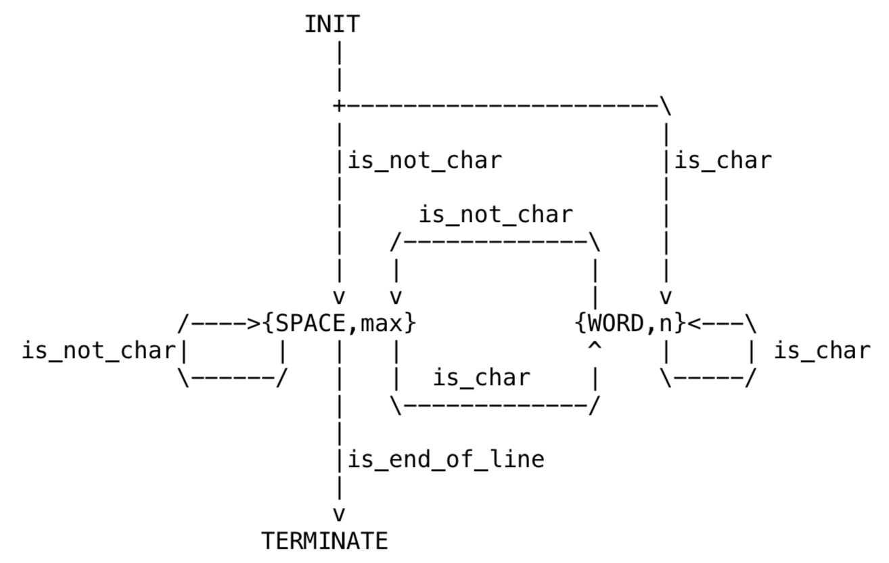

## Laboratory 2

#### FSM_interpreter class have attribute:
#### statesList is a list to store all states
#### stateNum is a int means now in which state
#### input ,means a num of input 
#### output means what final states is 
#### state_history is a list ,means the history states

## method Description:
##### add_state(self,state_name) 
##### this method have four parameter and used to create a state node ,
##### state_name is a string parameter means state description

#### changeState(self)
this method is used to from one state to next state,based on typeNumber choose a Aspect method

#### execute(self)
this method is used to execute the FSM and get the output state

#### showHistory(self)
this method is used to display the history states
***
## test model 1 Description
#### There are two traffic lights A,B at an intersection
#### The red light lasts for 35 seconds, the green light lasts for 30 seconds,
#### The green light will blink in the last five seconds,
#### And the yellow light lasts for 5 seconds

## test model 2 Description
#### give a String,to find the longest word in this String

# state graph

### list of group members:
Name: Chen ZhengHui  id:192050190

Name: Li Xiang  id:192050189

### laboratory work number:
variant 3
### variant description:
eDSL for finite state machine (Moore).
Visualization as a state diagram (GraphViz DOT) or table (ASCII).
Provide complex an example like a controller for an elevator, crossroad with a traffic light, etc.

### synopsis:
used FSM to create a traffic light and find longest word

### contribution summary for each group member:
we do this lab together

#