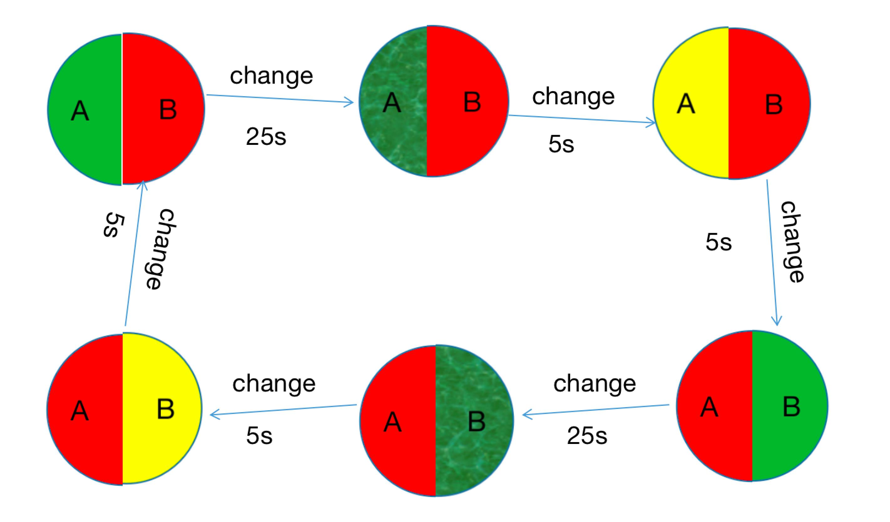

## Laboratory 2

## model Description
#### There are two traffic lights A,B at an intersection
#### The red light lasts for 35 seconds, the green light lasts for 30 seconds,
#### The green light will blink in the last five seconds,
#### And the yellow light lasts for 5 seconds

# state graph

#### there are two class FSM class and Node class,Node class define the state which include state name,length of time and color
#### FSM class have attribute:
#### states is a list to store all states
#### statenum is a int means now in which state
#### remaining_time is input ,means how long will sustain
#### outputColor is output,means what color is after remaining_time
#### state_history is a list ,means the history states

## method Description:
##### add_state(self,state_name,length_of_time,colorA,colorB) 
##### this method have four parameter and used to create a state node ,
##### state_name is a string parameter means state description
##### length_of_time is a int parameter means how long this state will sustain
##### colorA and colorB is a dict means the color of light in A and B direction 

#### create_all_states(self)
this method is used to create all possible states,because Moore FSM's states independent of input,so we want to create
all possible states and put it in a list

#### changeState(self)
this method is used to from one state to next state,if remaining_time is less than current state's length_of_time, means 
should stop and output current state,otherwise remaining_time should minus current state's length_of_time

#### execute(self)
this method is used to execute the FSM and get the output state

#### showHistory(self)
this method is used to display the history states
***

### list of group members:
Name: Chen ZhengHui  id:192050190

Name: Li Xiang  id:192050189

### laboratory work number:
variant3
### variant description:
eDSL for finite state machine (Moore).
Visualization as a state diagram (GraphViz DOT) or table (ASCII).
Provide complex an example like a controller for an elevator, crossroad with a traffic light, etc.

### synopsis:
used FSM to create a traffic light 

### contribution summary for each group member:
we do this lab together

#